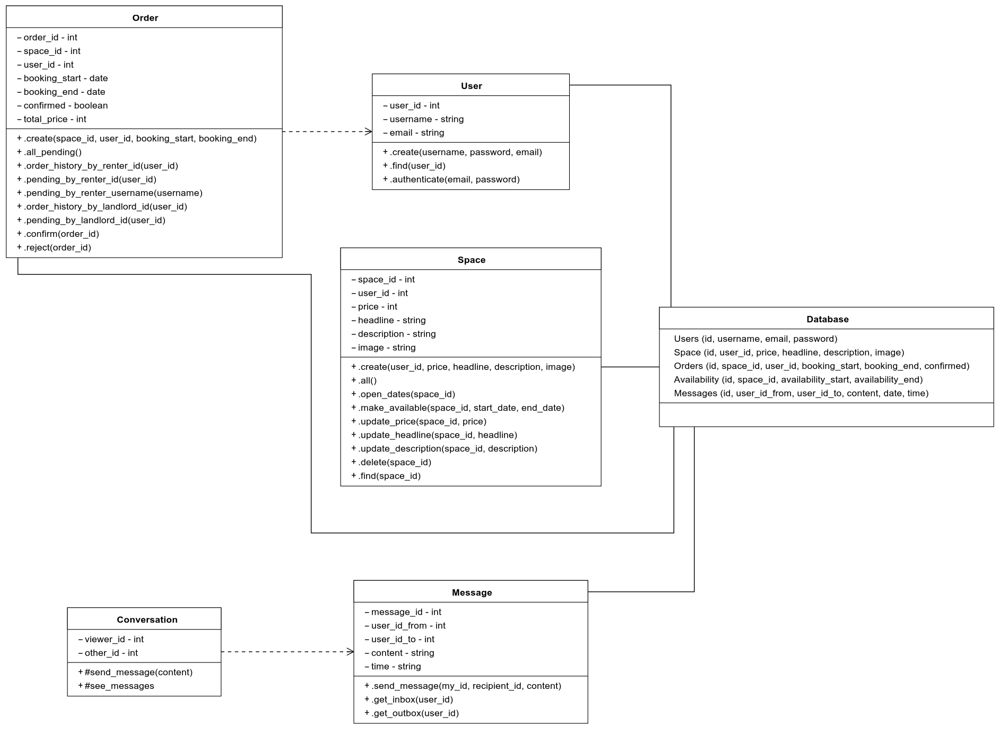
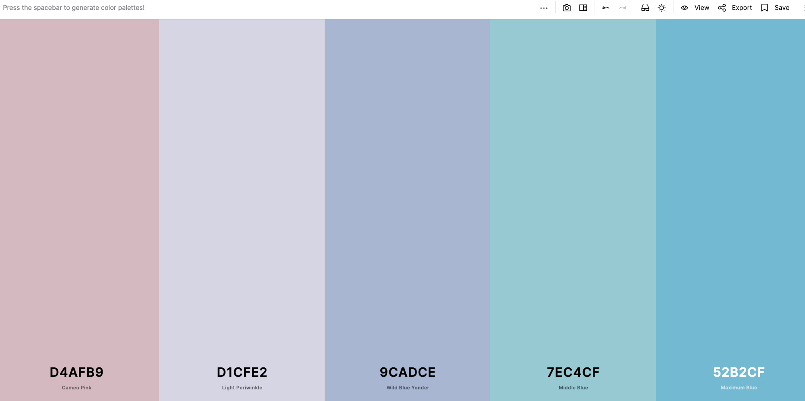
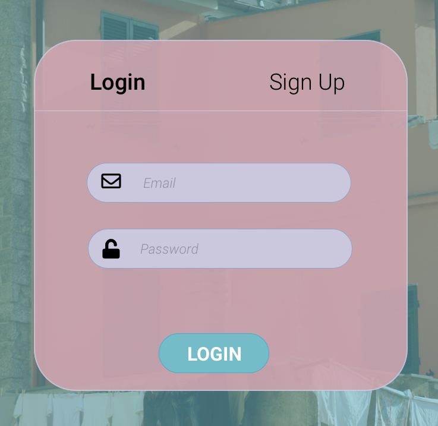
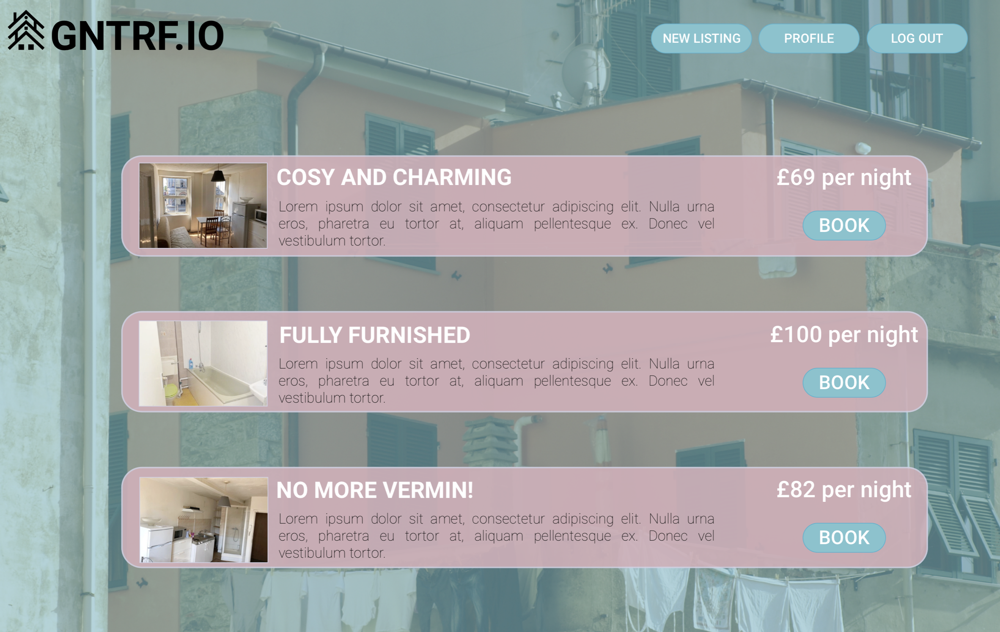
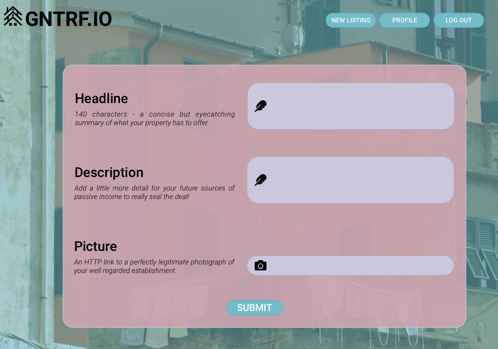
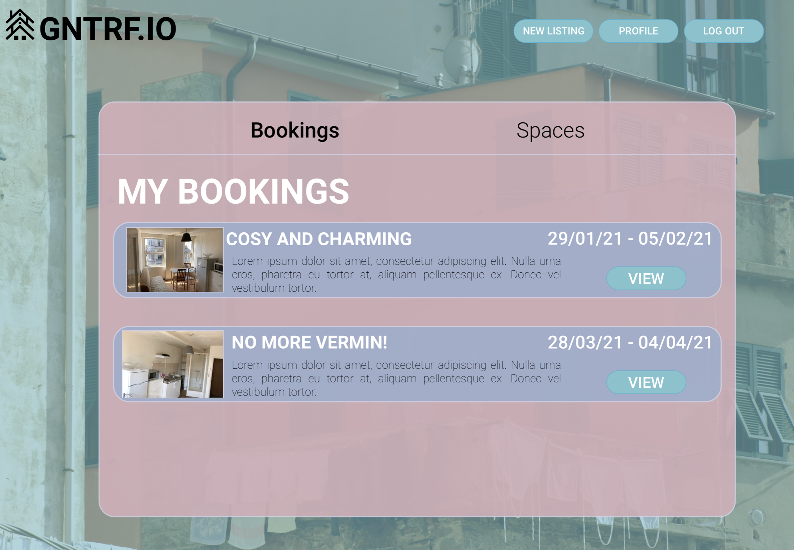

# GNTRF.IO-BNB
## Team Members:
- [Adam Grieve](https://github.com/AdamusBG) 
- [Alex Withington-Smith](https://github.com/ehwus)
- [Mike Linford](https://github.com/MykeNuLeng)
- [Symion Edwards](https://github.com/sedwards93)

## Project Overview:
This week saw our first group project with Maker's Academy. We were randomly assigned into teams of four and tasked with building an Airbnb clone using only a specification as guidance. 
## Our Workflow:
In order to work cohesively as a team, we ensured that we had regular team retros where we allocated work and assigned pairing partners for the day. We used a Trello board to list and assign outstanding tasks and split the workflow into front-end and back-end. This distinction minimised the number of GitHub pull request conflicts and streamlined our process.

## Technologies Used:
### Frontend

The frontend was implemented using HTML and CSS. Sinatra was used for the Model Controller View framework. Frontend testing was done with the Capybara/RSpec testing framework.
### Backend

The backend was built using Ruby and Postgres. We built object relational mappers to facilitate communication between database and out ruby codebase. Testing for the backend was achieved using the RSpec framework. 

## Minimum Viable Product:
On Monday, we agreed to work towards an MVP with functionality to sign up, log in and out, view spaces and their availability and book and approve stays. We generated the following user stories:

    As an end user,
    So I can see when a space is available
    I want to browse space availability with times

    As an end user,
    So that my bookings are mine
    I would like to sign up to GNTRF.IO

    As a signed up user looking to rent out my property,
    So others can see my listing,
    I want to be able to create a named space with a description and pricing

    As a signed up user looking to rent out my property,
    So that renters know when my property is available,
    I want to be able to select a range of dates for bookings to be available

    As a signed up user looking to rent,
    So that I know which bookings can be made,
    I want listings to show as available until claimed (by default)

    As a signed up user looking to rent,
    So that I can complete my booking,
    I want to be able to request a stay with the property owner

    As a signed up user looking to rent out my property,
    So that I know who will be staying,
    I want to be able to see and approve requests for my property

    As a signed up user looking to rent,
    So that I can have a location to myself
    I want a listing to be shown as claimed after booking a stay

## Class diagram:

## User interface:

## Run
1.  Clone the repo
2.  `$ bundle install`
3.  Setup the databases as per the instructions in the migrations folder. 
4.  `$ rackup`
5.  Visit localhost:9292 (or the port specified by rack in the terminal) in your web browser.